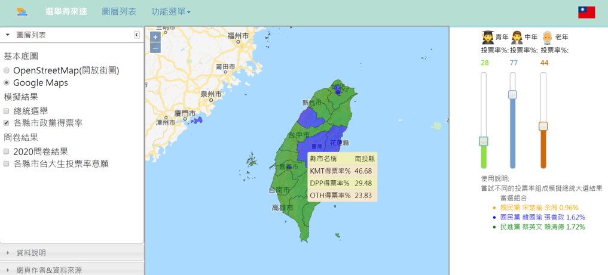
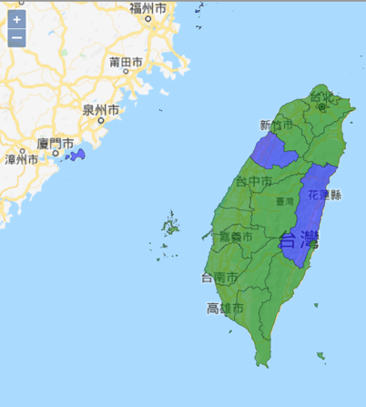
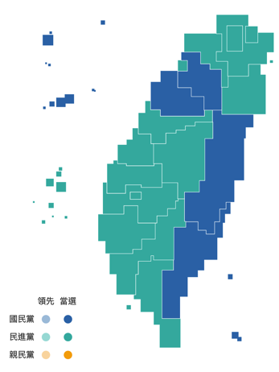

# 2020選舉得來速
**WebGIS term project** 
Team 10: 邵旻純, 李欣儒, 張禎晏, 王祥恒

## 一、介紹
* **2020 總統副總統暨立委選舉即將在 2020 年 1 月 11 日投票，選情拉鋸成為台灣輿論的注目焦點。本組希望利用 WebGIS 所學技能，創立預測選舉結果平台，本網站將結合2018 年 11 月 24 日地方公職人員選舉的統計資料，以及問卷調查的方式蒐集投票意向等調查資料，包括填寫者的戶籍地、現居地、去年縣市長選舉投給誰，以及明年 1 月總統副總統選舉的投票意願，以及要投給誰等進行資料前處理，用以統計各個縣市級行政區的三大年齡層的選民，從去年縣市首長大選到明年即將到來的總統大選，在政黨間的投票意向改變的比例，並以此為基礎，使用者得自行調整個老年、中年以及青年的投票率，即時於網站上展示預測的各縣市政黨預測之得票率以及總統大選結果。**

## 二、方法
* **1、歷史資料：使用距今最近的大選結果，也就是 2018 年 11 月 24 日的地方首長選舉作為背景值。但是，去年選舉資料在地理上雖可精確至各投開票所（鄰里等級），從內政部戶政司的人口統計資料，我們也可以取得各行政區的人口統計特徵值（例如：各鄉鎮市區，甚至各鄰里的各年齡層總人數、性別等），但是受限於不記名投票原則，各投開票所所開出的選舉票並無法回溯至該選舉人，也無從得知各特徵類型的人們的投票率為何。因此，在此我們只能預設一行政區劃當中「各年齡層的投票率、投票意向都一致」，來作為初始狀況的預設。**
* **2、網路表單：詢問填答人之年齡、設籍縣市、2018 年投給哪位縣市首長候選人、2020 年欲投給哪位總統副總統候選人，並在網路上傳播（主要傳播管道有二：Facebook「NTU 台大學生交流版」及團隊成員的家長 Line 群組）。在取得小型網路民調的回覆結果後，首先過濾掉無效樣本，再根據填答人的設籍縣市進行分類，並依照各個候選人的政黨類別進行整理**

## 三、成果介面
* **使用者可透過介面右邊拉霸的調整，得到不同年齡層投票比例，縣市的政黨得票率是多少**
* [LINK](http://140.112.64.232/rootvote/term/index.php)
### 

## 四、驗證
1. 專案成果(左)：藍>綠的縣市：  金、馬、苗栗、花蓮
2. 實際開票結果(右)：藍>綠的縣市：  金、馬、苗栗、花蓮、台東、新竹縣

